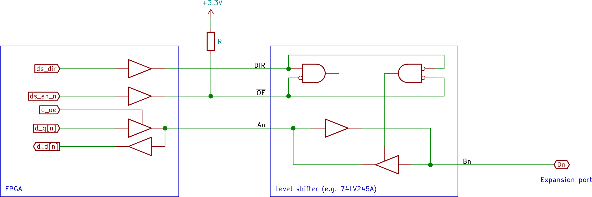
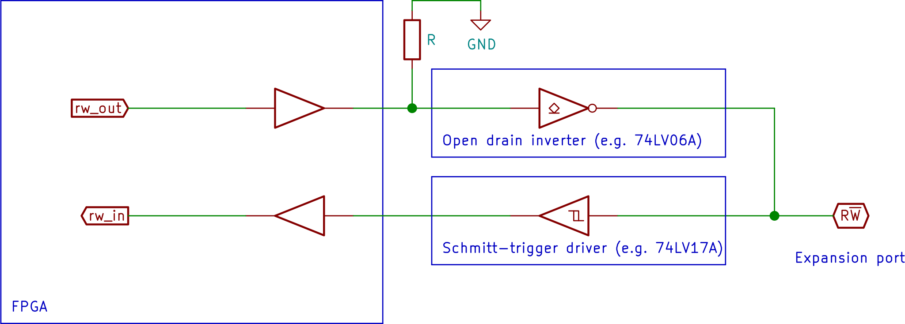

Guide to porting super-reu to new hardware
==========================================

This documents gives some pointers on what's needed to port super-reu
to a new FPGA platform.

FPGA resource requirements
--------------------------

### Clock speed

The design has been created for a system clock speed of 100 MHz.
It can probably still work at much lower speeds, but the timing
in `bus_manager` (and `chameleon_phi_clock`, if used) would need
to be adjusted accordingly.

### Number of logic elements

When implemented on a Cyclone 10, around 3000 logic elements are used
(see the [Quartus Fitter Usage Summary report](resource_usage_summary.txt)
for details) for the design with 4 DMA channels.  No LUTs with more than
4 inputs are used in this implementation.

### Block RAM

The only BRAM used by the design is for the ROML/ROMH emulation, which
uses 128 Kbits of BRAM.  ROMH is not actually used by the sample design,
so this can be halved if needed.  It's also possible to remove ROML as
well, booting software from floppy disk or datassette instead, to reduce
BRAM use to 0.

Conversely, if lots of BRAM is available, it can be used for the REU
memory thus removing the need for external RAM.

Required peripherals
--------------------

### Expansion port

The following expansion port pins must be available to the FPGA:

* `IRQ` - For the DMA channels to be able to raise interrupts, the FPGA
          must be able to pull the `IRQ` pin low.
* `R/W` - The FPGA must be able to both sample and drive this pin high/low.
* `EXROM` - For the boot ROM to work, the FPGA needs to be able to pull this
            pin low.
* `GAME` - Like `EXROM`, but needed only for `ROMH` which is not used by the
           sample boot ROM.
* `IO1`/`IO2` - The FPGA must be able to tell if _either_ of these are pulled
                low, but does not need to know which one.  The signals can
                be combined (with an AND gate) either internally or externally.
* `ROML`/`ROMH` - Like `IO1`/`IO2`, the FPGA must be able to tell if either
                  is pulled low, but does not need to differentiate between
                  them.  The default ROM does not rely on the `ROMH` pin being
                  connected, and if running without ROM there is no need to
                  connect `ROML` either.  If `ROMH` is unconnected, then
                  `GAME` must not be driven low.  If `ROML` is unconnected,
                  then `EXROM` must not be driven low,
* `BA` - The FPGA must be able to sample the level of this pin, to detect
         VIC use of the bus
* `DMA` - The FPGA must be able to pull this pin low (surprise!)
* `D0`-`D7` - The FPGA must be able to both sample, and drive these pins
              high/low.  A single control signal to control the direction of
              all 8 pins is sufficient.
* `A0`-`A15` - The FPGA must be able to both sample, and drive these pins
               high/low.  A single control signal to control the direction of
               all 16 pins is sufficient.
* `RESET` - The FPGA must be able to sample this pin, but in case loading of
            ROM code from an external source is used it should also be able
            to pull `RESET` low until the ROM load completes.
* `PHI2` - The FPGA must be able to sample this pin to align its bus cycle
           timing with that of the C64.

There does not need to be any connection to the `DOTClk` or `NMI` pins.

All inputs and outputs on the expansion port use TTL signal levels.
Level shifters should be added if required by the FPGA chip.

### RAM

128 Kbytes to 16 Mbytes of RAM is needed to back the external memory
of the DMA channels.  In the Chameleon implementation this is
implemented with an external SDRAM, but internal memory resources
could also be used.  At least two memory ports (one read/write, one
write only) are needed if the MMC64 function is desired, but accesses
are allowed to take multiple cycles, and can thus be serialized if only
one hardware port is available (as is the case with the SDRAM).

Optional peripherals
--------------------

### SD-card

If the MMC64 function is desired, an SDcard reader must be connected to
the FPGA.  Only SPI mode is used, so the mandatory signals are `CS`,
`CLK`, `DI`, `DO`, and `CD`.  `WP` is also expected, but only reported to
software and not needed by the sample application.

### SPI flash

The Chameleon implementation loads the contents of the ROM from SPI flash
on startup.  This is done to allow for convenient update of the ROM
contents, but is not necessary at all.  Even if using the ROM functionality,
the contents could be put into the FPGA bitstream using e.g. `$readmemh`.

### LEDs and buttons

The Chameleon implementation uses two LEDs to indicate init completion
and SDcard activity, and two buttons to reset the C64 and the FPGA
respectively.  This is completely optional.

RTL modules
------------

This section describes the RTL modules making up the super-reu core, and
how to interface them with a top level design.

### bus_manager

This module handles the interface to the C64 expansion port, and deals
with the bus cycle timing.

* `clk` - The system clock (100 MHz)
* `phi` - This should be a recreated PHI signal which is in phase with
          the external `PHI2` signal but synced with the `clk` clock for
          setup and hold purposes
* `ds_dir` - If a bidirectional level shifter is used for the data bus,
             this output indicates the currently desired direction,
             0 = C64 drives into FPGA, 1 = FPGA drives into expansion port.
* `ds_en_n` - If a bidirectional level shifter is used for the data bus,
              this output indicates wheter or not it should be active.
              0 = level shifter drives in the direction indicated by `ds_dir`,
              1 = both sides tri-stated
* `d_d` - Data bus input, connect to expansion port data bus
* `d_q` - Data bus output, drive data pins to this value when `d_oe` is 1
* `d_oe` - Data bus output enable.  0 = tristate data pins, 1 = drive data pins
* `as_dir` - If a bidirectional level shifter is used for the address bus,
             this output indicates the currently desired direction,
             0 = C64 drives into FPGA, 1 = FPGA drives into expansion port.
* `as_en_n` - If a bidirectional level shifter is used for the address bus,
              this output indicates wheter or not it should be active.
              0 = level shifter drives in the direction indicated by `as_dir`,
              1 = both sides tri-stated
* `a_d` - Address bus input, connect to expansion port address bus
* `a_q` - Address bus output, drive address pins to this value when `a_oe` is 1
* `a_oe` - Address bus output enable.  0 = tristate address pins, 1 = drive address pins
* `ba` - Connect this input to `BA` on the expansion port
* `ioef` - This input should be 1 whenever either `IO1` or `IO2` is low
* `romlh` - This input should be 1 whenever either `ROML` or `ROMH` is low.
            If ROM is not used (neither `EXROM` or `GAME` is driven low),
            this input can be set to constant 0.
* `rw_in` - Read/write control input, connect to `R/W` on the expansion port
* `rw_out` - Read/write control output; when this output is 1 the `R/W` pin
             on the expansion port should be driven low.  When it is 0 output
             should be tri-stated.
* `dma` - DMA output; when this output is 1 the `DMA` pin on the expansion
          port should be driven low.  When it is 0 output should be tri-stated.
* `romlhdata` - Data for `ROML`/`ROMH`.  Should be valid starting one system
                clock cycle after `romlh_r_strobe` is asserted.
* `romlh_r_strobe` - This output is set to 1 to trigger a read from ROM into
                     `romlhdata`.  The ROM address should be taken from the 14
                     least significant bits of the expansion port address bus.
* `ioefdata` - Data for `IO1`/`IO2`.  Should be valid starting one system
               clock cycle after `ioef_r_strobe` is asserted.
* `ioef_r_strobe` - This output is set to 1 to trigger a read from IO registers
                    into `ioefdata`.  The register address should be taken from
                    the 9 least significant bits of the expansion port address
                    bus.
* `ioef_w_strobe` - This output is set to 1 to trigger a write to IO registers.
                    The register address should be taken from the 9 least
                    significant bits of the expansion port address bus, and the
                    data to write from the expansion port data bus.
* `ff00_w_strobe` - This output is set to 1 for one system clock cycle when
                    a write to address FF00 is detected.
* `dma_a` - DMA request address input
* `dma_d` - DMA request data input (for write cycles)
* `dma_q` - DMA request data output (for read cycles), valid once the
            DMA operation is acked.
* `dma_rw` - Read/write mode for DMA request (0 = read, 1 = write)
* `dma_req` - Input which should be toggled to request a new DMA transfer
* `dma_ack` - Output which will take the value of `dma_req` once the DMA
              transfer has been completed.

The following schematic illustrates how a single bit of the data bus should
be hooked up when using external level shifters (address bus is analogous):

For open-collector signals such as `R/W`, a simpler level shifting setup
can be employed, as illustrated in the following schematic:

### address_decoder

This module handles accesses to the DE00-DFFF area by dividing the
address space into apertures handled by separate modules.  The
instantiation parameter `a_bits` indicate how many bits of the addresses
need to be tested.  This should be set to 9 since the upper 7 bits have
already been matched by the PLA in the C64.  The instantiation parmeter
`devices` specify the number of apertures, and the number of modules
they should be connected to.  Finally the instantiation parameters
`base_addresses` and `aperture_widths` give the base address (always a
full 16-bit address, but only the lower `a_bits` will actually be compared) 
and size (as a power of two) for each aperture.

* `a` - Input of the `a_bits` lowest bits of the expansion port address
* `read_strobe` - Connect to `ioef_r_strobe` on `bus_manager`
* `write_strobe` - Connect to `ioef_w_strobe` on `bus_manager`
* `read_data` - Connect to `ioefdata` on `bus_manager`
* `read_strobes` - Output of `devices` individual read strobes, one per device
* `write_strobes` - Output of `devices` individual write strobes, one per device
* `read_datas` - Input of `devices` groups of 8 bits, one per device, of
                 responses to read strobes

	
### dma_engine

The actual DMA channels.  The instantiation parameter `channels` select
the number of channels (1-16).  The register aperture must be at least
16*`channels` large.  The instantiation parameter `ram_a_bits` selects
the size of the expansion RAM addresses (17-24 bits).

* `clk` - The system clock (100 MHz)
* `reset` - Synchronous reset, when 1 all registers will be reset
* `irq` - When this output is 1, the expansion port `IRQ` pin should be
          pulled low.  When it is 0, the pin should be tri-stated.
* `a` - Address bus input, connect to expansion port address bus
* `d_d` - Data bus input, connect to expansion port data bus
* `d_q` - Data bus output, connect to `address_decoder`
* `read_strobe` - Connect to `address_decoder`
* `write_strobe` - Connect to `address_decoder`
* `ff00_strobe` - Connect to `ff00_w_strobe` on `bus_manager`
* `dma_a` - Connect to `bus_manager`
* `dma_d` - Connect to `bus_manager`
* `dma_q` - Connect to `bus_manager`
* `dma_rw` - Connect to `bus_manager`
* `dma_req` - Connect to `bus_manager`
* `dma_ack` - Connect to `bus_manager`
* `ram_a` - Address output for RAM port
* `ram_d` - Data output for RAM port writes
* `ram_q` - Data input from RAM port reads
* `ram_we` - Read/write mode for RAM port (0=read, 1=write)
* `ram_req` - Toggled when the module wants to perform a RAM operation
* `ram_ack` - Input which should take the value of `ram_req` once the
              RAM operation is complete
* `phi2tick` - This input should be 1 for one system clock cycle every
               period of the PHI2 clock.  It is used for the pacing
               functionality.

The suggested timing for `phi2tick` is to assert it towards the end of
the low part of PHI2, since the `dma_req` signal is sampled during the
first half of the low part of PHI2 (approx 200 ns from the falling
edge), which gives the DMA engine ample time to prepare the DMA
request before the next checkpoint.

### mmc64

The mmc64 module relies on an external implementation of SPI (this is
because the SPI implementation is shared with the ROM loading function
in the Chameleon implementation).  Thus it simply signals that it wants
to start a transfer and the 8 bits that it wants to send, and expects
the corresponding input bits to be available when the transfer request is
acknowledged.  The exact SPI clocks provided for the two speeds are not
important, but the fast speed should be at least 6 MHz to be able to
sustain steaming movie playback, and the slow speed must not exceed 400 kHz.

The instantiation parameter `ram_a_bits` selects the size of the
expansion RAM addresses (17-24 bits).

* `clk` - System clock
* `reset` - Synchronous reset, when 1 all registers will be reset
* `a` - Address bus input, connect to expansion port address bus
* `d_d` - Data bus input, connect to expansion port data bus
* `d_q` - Data bus output, connect to `address_decoder`
* `read_strobe` - Connect to `address_decoder`
* `write_strobe` - Connect to `address_decoder`
* `spi_q` - The DI bits collected during the latest SPI transfer
* `spi_d` - The DO bits to send in the next transfer
* `spi_req` - Toggled when the module wants to perform a new transfer
* `spi_speed` - Requested SPI clock of the transfer, 0=250 kHz, 1=8 MHz
* `spi_ack` - Input which should take the value of `spi_req` once the transfer is complete
* `wp` - Input from the Write Protect tab detector on the SDcard reader
* `cd` - Input from the Card Detect sensor on SDcard reader
* `spi_cs` - Card Select signal to the SDcard
* `exrom`, `game` - Inputs for the current state of the corresponding
                    expansion port pins.  Only used for the status register.
* `disable_exrom` - Output that indicates the state of bit 5 in the Control
                    register.  If using ROM, then the `EXROM` pin
                    should be driven low when this value is 0.
* `ram_a` - Address output for RAM port
* `ram_d` - Data output for RAM port writes
* `ram_q` - Data input from RAM port reads (not used)
* `ram_we` - Read/write mode for RAM port (always 1=write)
* `ram_req` - Toggled when the module wants to perform a RAM operation
* `ram_ack` - Input which should take the value of `ram_req` once the
              RAM operation is complete

### system_registers

A dummy register file example for adding new functionality.

* `clk` - System clock
* `a` - Address bus input, connect to expansion port address bus
* `d_d` - Data bus input, connect to expansion port data bus 
* `d_q` - Data bus output, connect to `address_decoder`
* `read_strobe` - Connect to `address_decoder`
* `write_strobe` - Connect to `addres_decoder`

### cart_bram

A simple ROM emulator based on BRAM.  It has one read port and
one write port (where the latter is used for initialization).

The instantiation parameter `ram_a_bits` selects the size of the
ROM addresses.  Use 14 for 16K ROM (`ROML`+`ROMH`), 13 for 8K ROM (`ROML` only).

* `clk` - System clock
* `read_addr` - Read port address input
* `write_addr` - Write port address input
* `read_data` - Read port data output
* `write_data` - Write port data input
* `read_strobe` - Read port strobe, data will be available the following cycle
* `write_strobe` - Write port strobe, data should be made available the same cycle
